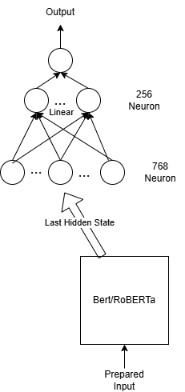
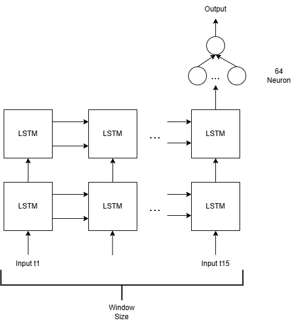

# 📈 Stock Price Prediction – Apple Closing Price Forecast Using Deep Learning

## 🔍 Overview

This project aims to predict the **closing price of Apple Inc. (AAPL)** using historical stock data and deep learning models. To enrich the training set and improve generalization, data from multiple companies are used. The core objective is to compare the performance of **transformer-based models (BERT, RoBERTa)** and a **sequence model (LSTM)** for short- and long-term stock price forecasting.

All models are implemented in **Python with PyTorch**, and performance is evaluated using **MSE** over multiple time lags (1-day, 7-day, 30-day forecasts).

## 🧠 Model Structures

### 🔹 Transformer-Based Models (BERT, RoBERTa)

  

These models use pretrained transformer encoders originally developed for natural language processing (NLP), such as BERT and RoBERTa, without task-specific fine-tuning for time-series forecasting. They are applied here to sequences of stock indicators by treating time-series data as token-like input, leveraging the transformers’ ability to model contextual relationships. However, they are not inherently optimized for sequential numeric data, which limits their forecasting performance in this context.

---

### 🔹 LSTM-Based Model

  

The LSTM model uses a traditional recurrent architecture well-suited for sequential financial data. It captures temporal trends and cycles, and in this project, it achieved the best predictive performance.

## 🧰 Technologies Used

- Python
- PyTorch
- Jupyter Notebook
- Scikit-learn
- Pandas
- Matplotlib

## 📋 Tasks and Features

- 📥 Collected and processed multi-company historical stock data.
- ⚙️ Engineered features like **RSI** and **MACD** for time-series enrichment.
- 🔁 Framed the problem as a supervised multivariate prediction task.
- 🧠 Implemented deep learning models:
  - **Transformer-based:** BERT, RoBERTa
  - **Recurrent:** LSTM
- ⏱ Trained models for multiple lags (3, 7, 15, 30, 90 days).
- 🔍 Evaluated performance using MSE on 1-day, 7-day, and 30-day forecasts.
- 🔄 Designed a **recursive multi-step prediction** method for longer horizons.

## 🔗 Dataset

- **Price-Volume Data for All US Stocks & ETFs**  
  [Link to Dataset on Kaggle](https://www.kaggle.com/datasets/borismarjanovic/price-volume-data-for-all-us-stocks-etfs)

## 📄 Project Report

For a full explanation of the methodology, data processing steps, model configurations, and analysis of results, please see the detailed report:

- [📘 View Full Report (PDF)](./report.pdf)

## 📈 Results

The models were tested across different lag intervals and forecast lengths. Here's a summary of the results:

### 🔹 MSE Comparison Table

| Model / Encoder | Lag | 1-Day MSE | 7-Day MSE | 30-Day MSE |
|------------------|-----|-----------|-----------|-------------|
| **BERT**         | 3   | 0.036     | 0.028     | 0.041       |
|                  | 7   | 0.037     | 0.011     | 0.042       |
|                  | 15  | 0.045     | 0.033     | 0.071       |
|                  | 30  | 0.055     | 0.110     | 0.120       |
|                  | 90  | 0.017     | 0.006     | 0.013       |
| **RoBERTa**      | 3   | 0.260     | 0.036     | 0.210       |
|                  | 7   | 0.260     | 0.267     | 0.270       |
|                  | 15  | 0.265     | 0.260     | 0.350       |
|                  | 30  | 0.267     | 0.413     | 0.477       |
|                  | 90  | 0.236     | 0.203     | 0.268       |
| **LSTM**         | 3   | **0.008**     | 0.004     | 0.159       |
|                  | 7   | **0.008**     | 0.007     | 0.012       |
|                  | 15  | 0.009     | **0.003**     | **0.002**       |
|                  | 30  | 0.017     | 0.021     | 0.020       |
|                  | 90  | 0.028     | 0.030     | 0.022       |

### 🔹 Observations

- **LSTM significantly outperforms** both transformer-based models across nearly all lag configurations.
- The **best performance** was achieved by the **LSTM model with a 15-day lag**.
- Recursive multi-step forecasting was used to simulate multi-day prediction by feeding previous model output as input for the next step.
